<div align="center">

# Hi there, I'm Divyanshu Jaiswal 👋

### Technical Intern @ Siemens Technology & Services | Full Stack Developer & Data Analyst
*Computer Science Engineering Graduate, Tula's Institute, Dehradun*

---

<!-- Side-by-Side Portrait & Info Panel -->
<table border="0" style="border: none; border-collapse: collapse;">
  <tr>
    <td width="45%" align="center" valign="top" style="border: none;">
      
    </td>
    <td width="55%" align="center" valign="top" style="border: none;">
      
    </td>
  </tr>
</table>

<br />

<!-- Contribution Heatmap -->
<div align="center">
  
</div>

---

### 🛠️ Tech Stack & Skills

```
  Languages   : Python, JavaScript, SQL
  Frontend    : HTML5, CSS3, React
  Backend     : Node.js, Express.js
  Database    : MySQL, MongoDB
  AI / GenAI  : LLM APIs, Generative AI, Prompt Engineering, RAG
  BI & Tools  : Power BI, MS Excel, REST APIs, Git, GitHub Actions, Docker
```

---

### 🚀 Highlights & Featured Projects

- **PGStay**: Full-stack property listing and booking platform built with React.js, Node.js, Express.js, and MongoDB featuring user authentication, property search with filters, and responsive UI. ([Repository](https://github.com/Divyanshu-Jaiswal-17/PGStay) · [Live Demo](https://pgstay-nine.vercel.app/))
- **METER/OPS**: Multi-tenant billing platform built with React, Node.js, Express, and MongoDB — featuring custom REST API endpoints for tenant management, invoice processing, and automated usage billing calculations.
- **GenAI Academic Documentation Generator**: RAG-based documentation generator powered by the Google Gemini API, actively serving **200+ users** for automated academic report creation.

---

### 📬 Connect with Me

<div align="center">

[](https://github.com/Divyanshu-Jaiswal-17)
[](https://www.linkedin.com/in/divyanshu-jaiswal-6856852a3/)
[](https://siemens.com)

<br /><br />


</div>

<br />

<div align="center">
  <sub><i>⚡ Automatically updated via GitHub Actions workflow</i></sub>
</div>

</div>
