# Hi, I'm Divyanshu Jaiswal 

**Data Analyst & Full-Stack Developer** · Siemens Technology & Services · Bengaluru

---

## 🚀 About Me

B.Tech CSE graduate (2026) currently interning at **Siemens Technology & Services** as a Technical Intern focused on Data & Business Intelligence. I work at the intersection of data engineering and full-stack development — building pipelines, dashboards, and web applications that turn raw data into actionable decisions.

- 🔭 Currently building **PGStay** — a MERN stack property listing platform
- 🛠️ Working on real-world BI solutions at Siemens using Power BI & Python
- 📊 Interested in Data Analytics, LLM APIs, and AI-powered tooling
- 📍 Based in Bengaluru | Originally from Dehradun

---

## 🧰 Tech Stack

**Data & Analytics**

**Full-Stack Development**

**Tools & Platforms**

---

## 💼 Experience

**Technical Intern — Data & BI** · Siemens Technology & Services Pvt. Ltd.
`Bengaluru · 2025–Present`

> Working on internal tooling and Business Intelligence projects. Building dashboards, automating reporting workflows, and supporting data analysis pipelines using Python and Power BI.

---

## 🌟 Featured Projects

### 🏠 PGStay
> Full-stack property listing and booking platform for PG accommodations

**Stack:** React.js · Node.js · Express.js · MongoDB  
**Highlights:** Authentication system, property search with filters, listing management, responsive UI  
**Links:** [📁 Repository](https://github.com/Divyanshu-Jaiswal-17/PGStay) · [🚀 Live Demo](https://pgstay-nine.vercel.app/)

---

## 📈 GitHub Stats

---

## 🎯 Currently Learning

- 📊 Advanced DAX for Power BI reporting
- 🤖 LLM API integration (Gemini, Claude) for intelligent applications
- 🔗 RAG pipelines for domain-specific AI tooling
- ☁️ Azure fundamentals for cloud-based data solutions

---

*"Data tells the story. Code makes it visible."*

